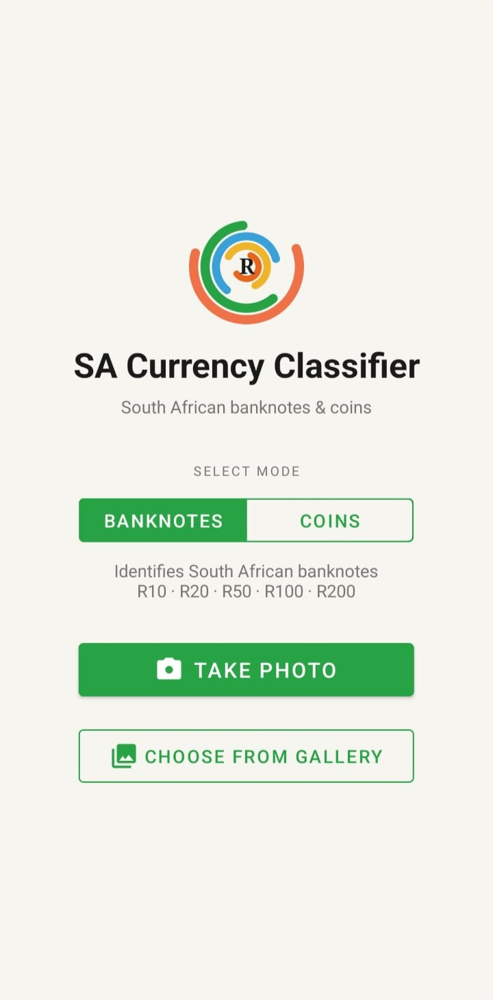
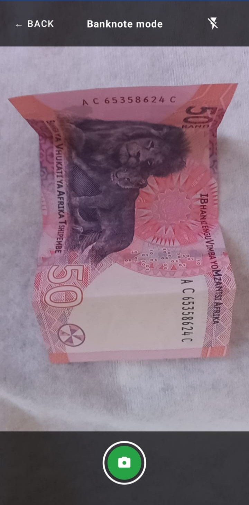
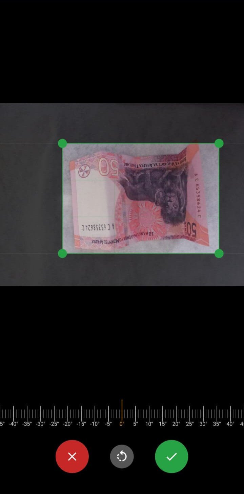
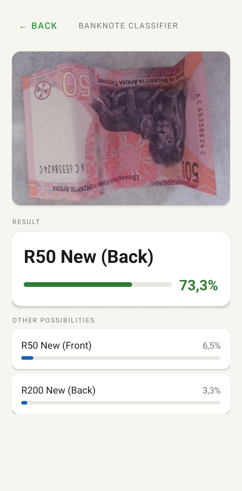

# SA Currency Classifier - Android App

An Android app that identifies South African banknotes and coins using on-device TFLite models. No internet connection required - all inference runs locally on the device.

The companion ML training pipeline lives here: [SA-Currency-Classifier-Model](https://github.com/Shaista149/SA-Currency-Classifier-Model)

---
## Screenshots

| Main | Camera | Crop | Result |
|---|---|---|---|
|  |  |  |  |

---

## Features

- Classify **banknotes** (R10, R20, R50, R100, R200) or **coins** (5c, 10c, 20c, 50c, R1, R2, R5)
- Identifies denomination, era (old/new), and side (front/back)
- **Camera capture** with tap-to-focus and torch toggle
- **Gallery import** for classifying existing photos
- **Manual crop** with rotation ruler for fine-tuning the crop angle
- **Auto-crop** detects the note/coin boundary automatically using luminance variance
- **Rotation-invariant inference** - runs the model at 0/90/180/270 degrees and picks the best result, so notes and coins don't need to be held in any particular orientation
- **Top-3 results** displayed with confidence percentages and colour-coded bars (green/amber/red)
- Fully offline - no data is sent anywhere

---

## Screens

**Main screen** - Toggle between Notes and Coins mode, then choose Camera or Gallery.

**Camera screen** - Live viewfinder with tap-to-focus, torch toggle, and capture button.

**Crop screen** - Adjust the crop area with draggable handles. Use the rotation ruler at the bottom for fine angle correction, or the rotate button for 90-degree flips.

**Result screen** - Displays the top prediction with confidence, plus the 2nd and 3rd most likely classes.

---

## Requirements

- Android 8.0 (API 26) or higher
- Camera permission (for camera capture)
- Storage permission (for gallery import)

---

## Tech Stack

| Component | Library |
|---|---|
| Language | Kotlin |
| UI | ViewBinding, Material 3 |
| Camera | CameraX 1.3.1 |
| Inference | TensorFlow Lite 2.14.0 |
| Image loading | Android BitmapFactory + ExifInterface |
| JSON parsing | Gson 2.10.1 |

---

## Project Structure

```
app/src/main/
-
- assets/
-   banknote_model.tflite    # Float16 TFLite model (5.6 MB)
-   banknote_classes.json    # Class index map for banknotes
-   coin_model.tflite        # Float16 TFLite model (5.6 MB)
-   coin_classes.json        # Class index map for coins
-
- java/.../sacurrencyclassifier/
-   MainActivity.kt          # Mode toggle + camera/gallery entry points
-   CameraActivity.kt        # CameraX viewfinder, tap-to-focus, torch
-   CropActivity.kt          # Manual crop with rotation ruler
-   CropView.kt              # Custom crop overlay view
-   RotationRulerView.kt     # Draggable ruler for fine angle control
-   CurrencyClassifier.kt    # TFLite inference, auto-crop, rotation handling
-   ResultActivity.kt        # Displays top-3 predictions with confidence
-   RingLogoView.kt          # Custom animated logo view
```

---

## How It Works

1. User selects Notes or Coins mode on the main screen
2. Image is captured via camera or imported from gallery
3. The crop screen lets the user refine the region of interest
4. `CurrencyClassifier` runs auto-crop (luminance variance detection) then runs inference at 4 rotations (0/90/180/270 degrees), keeping the result with the highest top-1 confidence
5. Softmax outputs are mapped to class labels via `classes.json`
6. Top-3 predictions are shown with colour-coded confidence bars

---

## Models

Both models are MobileNetV2 with a Squeeze-and-Excitation attention block, trained in two phases (frozen backbone then fine-tuning with cosine LR decay), and exported as Float16 TFLite at 5.6 MB each.

| Model | Classes | Test Accuracy |
|---|---|---|
| Banknotes | 20 | 92.8% |
| Coins | 28 | 87.9% |

Full training details in the [model repo](https://github.com/Shaista149/SA-Currency-Classifier-Model).

---

## Related

- **Model repo:** [SA-Currency-Classifier-Model](https://github.com/Shaista149/SA-Currency-Classifier-Model)
